# IKEA Shopping Assistant - System Architecture

## 🎯 Overview

A conversational AI shopping assistant for IKEA that combines natural language understanding, semantic search, and browser automation to enable intelligent cart management.

### Key Features
- 🤖 **LLM-Based Product Selection** - Natural language product matching instead of hardcoded references
- 🛒 **Automated Cart Management** - Add/remove items via browser automation with video recordings
- 🔍 **RAG-Powered Search** - Semantic product search using ChromaDB vector database
- 💬 **Conversational Interface** - Natural language conversations with context awareness
- 🎥 **Action Videos** - Visual proof of cart operations with WebM recordings

---

## 🏗️ Complete System Architecture

### System Architecture Diagram


*The diagram above shows the complete system architecture with all layers and data flows.*

### High-Level System Overview

```mermaid
flowchart TB
    subgraph "User Layer"
        A[👤 User Browser]
    end
    
    subgraph "Presentation Layer"
        B[🌐 Flask Web Server<br/>Port 5000]
        C[📝 Session Manager<br/>Flask-Session]
    end
    
    subgraph "AI Agent Layer"
        D[🤖 IKEA Agent<br/>LangGraph State Machine]
        E[🧠 Gemini 2.5 Flash<br/>Intent Analysis]
        F[🎯 Product Resolver<br/>LLM Matching]
    end
    
    subgraph "Data Layer"
        G[🔍 RAG Manager<br/>Semantic Search]
        H[(📦 ChromaDB<br/>Vector Store)]
        I[💾 Product Data<br/>JSON Files]
    end
    
    subgraph "Automation Layer"
        J[🎭 Browser Manager<br/>Playwright]
        K[🛒 Cart Automation<br/>IKEA Actions]
        L[🎥 Video Recorder<br/>WebM Format]
    end
    
    subgraph "External Systems"
        M[🌍 IKEA Website<br/>ikea.com]
    end
    
    A -->|HTTP Request| B
    B <-->|Session State| C
    B -->|User Query| D
    
    D -->|Analyze Intent| E
    D -->|Match Products| F
    D -->|Search Products| G
    
    G <-->|Vector Search| H
    H -->|Embeddings| I
    
    D -->|Cart Operations| K
    K -->|Automate| J
    J -->|Navigate| M
    J -->|Record| L
    
    L -->|Video| B
    F -->|Results| D
    G -->|Results| D
    K -->|Status| D
    
    D -->|Response| B
    B -->|HTML| A
    
    style A fill:#e1f5ff
    style B fill:#fff4e1
    style D fill:#f0e1ff
    style G fill:#e1ffe1
    style J fill:#ffe1e1
    style M fill:#f5f5f5
```



### System Components Explanation

#### 1️⃣ **User Layer**
- **User Browser**: Web interface where users interact with the chatbot
- **Technologies**: Modern web browsers (Chrome, Firefox, Safari)
- **Function**: Sends queries, receives responses with product cards and videos

#### 2️⃣ **Presentation Layer**
- **Flask Web Server**: Handles HTTP requests and serves the chat interface
- **Session Manager**: Maintains conversation state, cart items, and search history
- **Function**: Routes requests, manages sessions, renders markdown responses

#### 3️⃣ **AI Agent Layer**
- **IKEA Agent**: Central orchestrator using LangGraph state machine
- **Gemini LLM**: Analyzes user intent and generates natural language responses
- **Product Resolver**: NEW feature that intelligently matches products using LLM
- **Function**: Understands queries, routes to appropriate handlers, manages conversation flow

#### 4️⃣ **Data Layer**
- **RAG Manager**: Handles semantic product search using vector embeddings
- **ChromaDB**: Stores product embeddings for fast similarity search
- **Product Data**: JSON files with scraped IKEA product information
- **Function**: Retrieves relevant products based on semantic similarity

#### 5️⃣ **Automation Layer**
- **Browser Manager**: Controls Playwright browser sessions
- **Cart Automation**: Executes add/remove/view cart operations on IKEA website
- **Video Recorder**: Records all browser actions as WebM videos
- **Function**: Automates cart management with visual proof

#### 6️⃣ **External Systems**
- **IKEA Website**: Target e-commerce platform for cart operations
- **Function**: Actual cart management backend

---

## 🔄 Detailed Data Flow Architecture

### Complete Request-Response Flow

```mermaid
sequenceDiagram
    participant U as 👤 User
    participant F as 🌐 Flask
    participant A as 🤖 Agent
    participant G as 🧠 Gemini
    participant R as 🔍 RAG
    participant P as 🎯 Resolver
    participant B as 🎭 Browser
    participant I as 🌍 IKEA
    participant V as 🎥 Video
    
    U->>F: POST query: "add ergonomic chair"
    activate F
    
    F->>A: handle_query(query, state)
    activate A
    
    A->>G: analyze_intent(query)
    activate G
    G-->>A: intent="add_to_cart"
    deactivate G
    
    Note over A: Check if products<br/>already shown
    
    alt No products shown
        A->>R: search("ergonomic chair")
        activate R
        R->>R: Embed query
        R->>R: Vector search
        R-->>A: [product_list]
        deactivate R
    end
    
    A->>P: resolve_product_reference()
    activate P
    P->>G: Match "ergonomic chair"<br/>to product list
    G-->>P: matched_product<br/>confidence=0.85
    P-->>A: resolution{product, conf}
    deactivate P
    
    alt Confidence >= 0.7
        A->>B: add_to_cart(product_url)
        activate B
        
        B->>V: start_recording()
        activate V
        
        B->>I: Navigate to URL
        activate I
        B->>I: Click "Add to bag"
        I-->>B: Confirmation
        deactivate I
        
        B->>V: stop_recording()
        V-->>B: video.webm
        deactivate V
        
        B-->>A: success + video_path
        deactivate B
        
        A-->>F: response + video HTML
    else Confidence < 0.7
        A-->>F: clarification_message
    end
    
    deactivate A
    F-->>U: HTML response + video
    deactivate F
```



### Flow Explanation by Phase

#### **Phase 1: Query Reception** (1-2 sec)
```
User Input → Flask → Session Retrieval
```
- User types natural language query
- Flask receives POST request
- Session state loaded (previous products, cart items, context)
- **Output**: Clean query string + conversation history

#### **Phase 2: Intent Classification** (1-2 sec)
```
Query → Gemini LLM → Intent Decision
```
- Gemini analyzes query with conversation context
- Classifies into: search, add_to_cart, remove_from_cart, view_cart, other
- Extracts entities (product features, price range, colors)
- **Output**: Structured intent + extracted parameters

#### **Phase 3: Product Search** (0.5-1 sec) *if needed*
```
Search Query → Embeddings → Vector DB → Results
```
- Generate query embeddings using ONNX model
- Perform hybrid search (keyword + semantic)
- Filter by price, color, features
- Rank by relevance score
- **Output**: List of matching products with metadata

#### **Phase 4: Product Resolution** (1-2 sec) *for cart ops*
```
User Reference → LLM Matching → Confidence Score → Action
```
- LLM analyzes product reference in context
- Matches to available products
- Calculates confidence (0.0 to 1.0)
- Decides: execute (≥0.7), confirm (0.5-0.7), clarify (<0.5)
- **Output**: Matched product + confidence + reasoning

#### **Phase 5: Cart Automation** (5-8 sec) *for cart ops*
```
Product URL → Browser Navigation → Action → Video Recording
```
- Playwright browser launches (headless)
- Navigate to product/cart page
- Execute action (click buttons)
- Record entire process as video
- Save browser state (cookies, localStorage)
- **Output**: Success status + video file

#### **Phase 6: Response Generation** (0.5 sec)
```
Results → Markdown Formatting → HTML Rendering → User Display
```
- Format products as HTML cards
- Embed videos if applicable
- Generate natural language explanation
- Add helpful suggestions
- **Output**: Rich HTML response

---

## 🎯 Agent Decision Flow

### Intent-Based Routing Logic

```mermaid
flowchart TD
    Start([User Query]) --> Analyze{Analyze Intent<br/>with Gemini}
    
    Analyze -->|search| Search[🔍 Product Search]
    Analyze -->|add_to_cart| AddCart[➕ Add to Cart]
    Analyze -->|remove_from_cart| RemoveCart[➖ Remove from Cart]
    Analyze -->|view_cart| ViewCart[👁️ View Cart]
    Analyze -->|clarification| Clarify[❓ Ask Questions]
    Analyze -->|other| Respond[💬 Conversational]
    
    Search --> RAG{RAG Search}
    RAG --> Filter[Filter by<br/>Price/Color/Features]
    Filter --> Format[Format as<br/>Product Cards]
    Format --> End([Return Response])
    
    AddCart --> HasProducts{Products<br/>Shown?}
    HasProducts -->|No| RAG
    HasProducts -->|Yes| Resolve{Product<br/>Resolver}
    
    Resolve --> HighConf{Confidence<br/>≥ 0.7?}
    HighConf -->|Yes| Execute[Execute Add]
    HighConf -->|No| MidConf{Confidence<br/>≥ 0.5?}
    
    MidConf -->|Yes| Confirm[Ask Confirmation]
    MidConf -->|No| Clarify2[Request Clarification]
    
    Execute --> Browser[Browser Automation]
    Browser --> Record[Record Video]
    Record --> End
    
    Confirm --> End
    Clarify2 --> End
    
    RemoveCart --> ResolveRemove{Product<br/>Resolver}
    ResolveRemove --> HighConf2{Confidence<br/>≥ 0.7?}
    HighConf2 -->|Yes| ExecuteRemove[Execute Remove]
    HighConf2 -->|No| ShowDropdown[Show Dropdown<br/>Selector]
    
    ExecuteRemove --> Browser
    ShowDropdown --> End
    
    ViewCart --> BrowserView[Browser: View Cart]
    BrowserView --> ScrapeCart[Scrape Cart Items]
    ScrapeCart --> Record
    
    Clarify --> AskDetails[Ask for Details:<br/>Price/Color/Features]
    AskDetails --> End
    
    Respond --> GenerateReply[Generate Natural<br/>Language Reply]
    GenerateReply --> End
    
    style Start fill:#e1f5ff
    style End fill:#e1ffe1
    style Analyze fill:#fff4e1
    style Resolve fill:#f0e1ff
    style Browser fill:#ffe1e1
```



### Decision Tree Explanation

#### **🔍 Search Path**
1. Extract search criteria from query
2. Generate embeddings for semantic search
3. Query ChromaDB vector store
4. Filter results by metadata
5. Rank by relevance
6. Format as HTML product cards
7. Return to user

#### **➕ Add to Cart Path**
1. Check if products already shown in conversation
2. If not, perform RAG search first
3. Use LLM Product Resolver to match user's reference
4. **High Confidence (≥0.7)**: Execute immediately
   - Launch browser
   - Navigate to product
   - Click "Add to bag"
   - Record video
5. **Medium Confidence (0.5-0.7)**: Ask confirmation
   - "Did you mean [Product Name]?"
6. **Low Confidence (<0.5)**: Request clarification
   - Show available options
   - Ask user to be more specific

#### **➖ Remove from Cart Path**
1. Use LLM to match product description to cart items
2. **High Confidence**: Execute removal
3. **Low Confidence**: Show dropdown selector
4. Record removal action as video

#### **👁️ View Cart Path**
1. Launch browser to cart page
2. Scrape cart contents
3. Display items with prices
4. Record cart view as video

---

## 🔧 Component Architecture

### Agent State Machine

```mermaid
stateDiagram-v2
    [*] --> Idle
    
    Idle --> ClassifyIntent: User Query
    
    ClassifyIntent --> SearchProducts: intent=search
    ClassifyIntent --> AddToCart: intent=add_to_cart
    ClassifyIntent --> RemoveFromCart: intent=remove_from_cart
    ClassifyIntent --> ViewCart: intent=view_cart
    ClassifyIntent --> Conversational: intent=other
    
    SearchProducts --> RAGRetrieval
    RAGRetrieval --> FilterResults
    FilterResults --> FormatResponse
    
    AddToCart --> CheckProducts: Need products?
    CheckProducts --> RAGRetrieval: No products
    CheckProducts --> ResolveProduct: Has products
    
    ResolveProduct --> HighConfidence: conf ≥ 0.7
    ResolveProduct --> MediumConfidence: 0.5 ≤ conf < 0.7
    ResolveProduct --> LowConfidence: conf < 0.5
    
    HighConfidence --> BrowserAutomation
    MediumConfidence --> ConfirmWithUser
    LowConfidence --> RequestClarification
    
    BrowserAutomation --> RecordVideo
    RecordVideo --> FormatResponse
    
    RemoveFromCart --> ResolveCart
    ResolveCart --> BrowserAutomation
    
    ViewCart --> BrowserAutomation
    
    Conversational --> GenerateReply
    GenerateReply --> FormatResponse
    
    ConfirmWithUser --> FormatResponse
    RequestClarification --> FormatResponse
    
    FormatResponse --> ReturnToUser
    ReturnToUser --> Idle
    
    Idle --> [*]
```



---

## 📁 Project Structure

```
ClickelssUI/
├── agent/                    # AI Agent Layer
│   ├── ikea_agent.py        # Main conversational agent with LangGraph
│   ├── product_resolver.py # LLM-based product matching (NEW!)
│   ├── rag_tool.py          # RAG search interface
│   └── tools/
│       └── cart_tools.py    # Cart operation tools
│
├── automation/              # Browser Automation Layer
│   ├── browser_manager.py  # Playwright session management  
│   └── ikea_cart.py        # IKEA cart automation with video recording
│
├── scraper/                 # Data Collection Layer
│   ├── ikea_scraper.py     # Web scraper for IKEA products
│   ├── rag_manager.py      # ChromaDB vector store manager
│   ├── data_processor.py   # Data cleaning and processing
│   └── embedding_generator.py
│
├── web/                     # Web Interface
│   └── app.py              # Flask application
│
├── data/                    # Data Storage
│   ├── raw/                # Scraped JSON data
│   ├── processed/          # Cleaned product data
│   └── chroma_db/          # Vector embeddings
│
├── tests/                   # Test Suite
│   ├── test_product_selection_simple.py  # Product resolver tests
│   └── test_remove_from_cart.py         # Cart operation tests
│
└── scripts/                 # Utility Scripts
    └── run_scraper.py      # Data collection script

```

---

## 🔧 Core Components

### 1. **Agent Layer** (`agent/`)

#### IKEA Agent (`ikea_agent.py`)
- **Purpose**: Main conversational AI agent
- **Technology**: LangGraph state machine with Gemini LLM
- **Capabilities**:
  - Intent classification (search, add_to_cart, remove_from_cart, view_cart)
  - Conversation context management
  - Dynamic product search with filters
  - Natural language response generation

#### Product Resolver (`product_resolver.py`) 🆕
- **Purpose**: Intelligent product matching using LLM
- **Features**:
  - Semantic understanding ("the ergonomic chair with wheels")
  - Confidence scoring (0.0 to 1.0)
  - Automatic clarification requests
  - Fallback keyword matching
- **Example**:
  ```python
  resolution = resolve_product_reference(
      query="add the modern office chair",
      available_products=last_shown,
      conversation_history=messages
  )
  # Returns: {"matched_products": [...], "confidence": 0.85, "reasoning": "..."}
  ```

#### RAG Tool (`rag_tool.py`)
- **Purpose**: Semantic product search
- **Technology**: ChromaDB with ONNX embeddings
- **Search Capabilities**:
  - Keyword + semantic search
  - Price range filtering  
  - Color/feature extraction
  - Top-k results with metadata

### 2. **Automation Layer** (`automation/`)

#### Browser Manager (`browser_manager.py`)
- Playwright browser session management
- Video page creation for recordings
- Shared browser context

#### IKEA Cart Manager (`ikea_cart.py`)
- **add_to_cart(product_url)**: Navigate and add items
- **view_cart()**: Scrape cart contents
- **remove_from_cart(product_name)**: Remove items by name
- **Video Recording**: All actions recorded as WebM videos
- **State Persistence**: Browser state saved between sessions

### 3. **Data Layer** (`scraper/`)

#### RAG Manager (`rag_manager.py`)
- ChromaDB collection management
- Embedding generation (ONNX or OpenAI)
- Metadata filtering
- Semantic search API

#### Data Flow
```
IKEA Website → Scraper → JSON → Processor → Embeddings → ChromaDB
```

### 4. **Web Interface** (`web/`)

#### Flask App (`app.py`)
- Chat interface with session management
- Video/screenshot serving
- Markdown rendering for product cards
- Auto-clears temporary data on startup

---

## 🔄 Data Flow Examples

### Example 1: Natural Language Add to Cart

```
User: "add the ergonomic chair with armrests"
  ↓
[Intent Analysis] → "add_to_cart"
  ↓
[Product Resolver] 
  - LLM matches query to products
  - Confidence: 0.85
  - Matched: JÄRVFJÄLLET chair
  ↓
[Cart Automation]
  - Navigate to product URL
  - Click "Add to bag"
  - Record video
  ↓
User: "✅ Added JÄRVFJÄLLET to cart! [video]"
```

### Example 2: Ambiguous Query Handling

```
User: "add a chair"
  ↓
[Product Resolver]
  - Confidence: 0.3 (too low)
  - needs_clarification: true
  ↓
[Clarification Generator]
  ↓
User: "I found multiple chairs. Which one?
       1. MARKUS - $229
       2. JÄRVFJÄLLET - $279
       3. FLINTAN - $79.99"
```

---

## 🛠️ Technology Stack

### AI/LLM
- **Google Gemini 2.5 Flash** - Primary LLM
- **LangGraph** - Agent workflow orchestration
- **LangChain** - Tool integration

### Vector Search
- **ChromaDB** - Vector database
- **ONNX Embeddings** - Default embedding model
- **Semantic search** - Hybrid keyword + vector search

### Browser Automation
- **Playwright** - Headless browser automation
- **Video Recording** - WebM format
- **State Persistence** - Cookie + localStorage

### Web Framework
- **Flask 3.1** - Web server
- **Flask-Session** - Server-side sessions
- **Markdown** - Rendering

---

## 📊 Agent State Machine


---

## 🔐 Environment Variables

Required in `.env`:
```bash
GOOGLE_API_KEY=your_gemini_api_key
OPENAI_API_KEY=optional_for_embeddings
```

---

## 🚀 Performance Characteristics

| Metric | Value |
|--------|-------|
| Product Search | < 1s |
| LLM Intent Analysis | ~1-2s |
| Product Resolver | ~1.5s |
| Cart Operation | ~5-8s |
| Video Recording | Real-time |
| Total Response Time | ~3-5s |

---

## 🔄 Recent Enhancements

### LLM-Based Product Selection (Latest)
- **Before**: Hardcoded ordinal references ("first one", "second one")
- **After**: Natural language understanding ("the ergonomic chair with wheels")
- **Benefits**:
  - More intuitive user experience
  - Semantic product matching
  - Confidence-based decision making
  - Automatic clarification for ambiguous queries

### Video Recording
- All cart operations recorded as WebM videos
- Embedded in chat responses
- Provides visual proof of actions
- Stored in `videos/` directory

---

## 📈 Future Enhancements

1. **Multi-Category Support** - Expand beyond chairs
2. **User Preferences** - Learn from interactions
3. **Price Tracking** - Alert on price drops
4. **Image Search** - Upload chair photos
5. **Voice Interface** - Speech-to-text/text-to-speech

---

## 🧪 Testing

### Unit Tests
- `test_product_selection_simple.py` - Product resolver (5/5 passing)
- `test_remove_from_cart.py` - Cart operations

### Manual Testing
```bash
# Start the application
/opt/homebrew/anaconda3/bin/python web/app.py

# Visit http://127.0.0.1:5000
# Try: "show me office chairs under $200"
# Try: "add the ergonomic one"
# Try: "remove the chair"
```

---

## 📝 Key Design Decisions

1. **LLM for Product Matching** - Chose Gemini for semantic understanding over simple keyword matching
2. **Confidence Thresholding** - Three-tier system (high/moderate/low) for user experience
3. **Video Recording** - Visual proof reduces user uncertainty about cart actions
4. **State Persistence** - Browser cookies saved between sessions for reliability
5. **Fallback Mechanisms** - Keyword matching when LLM unavailable

---

**Architecture Version**: 2.0 (November 2025)
**Last Updated**: Post LLM Product Selection Enhancement
